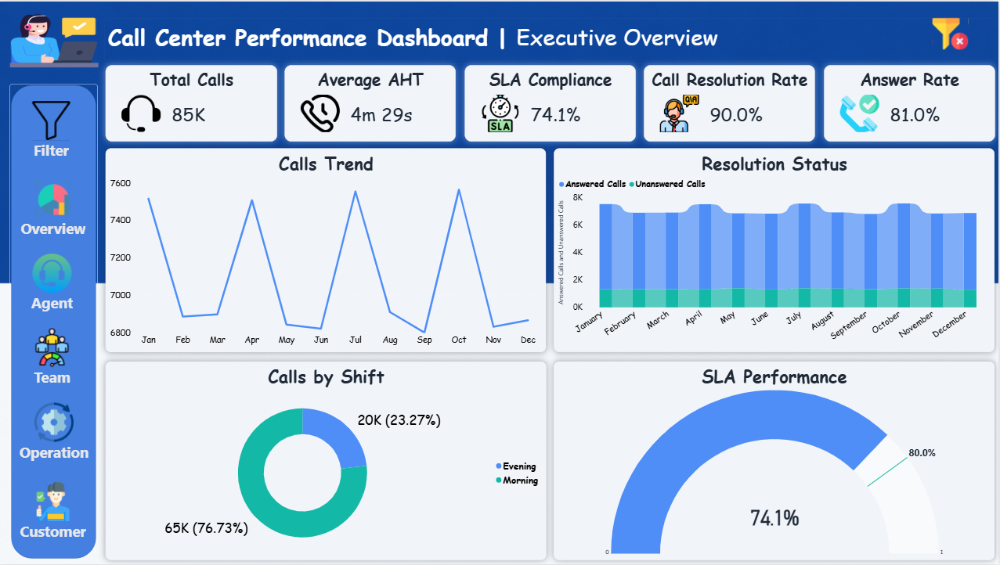
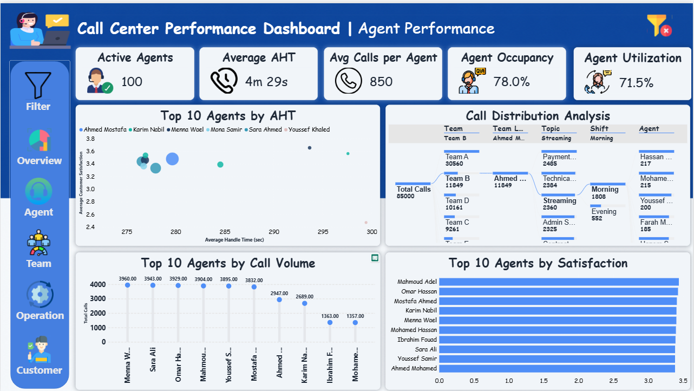
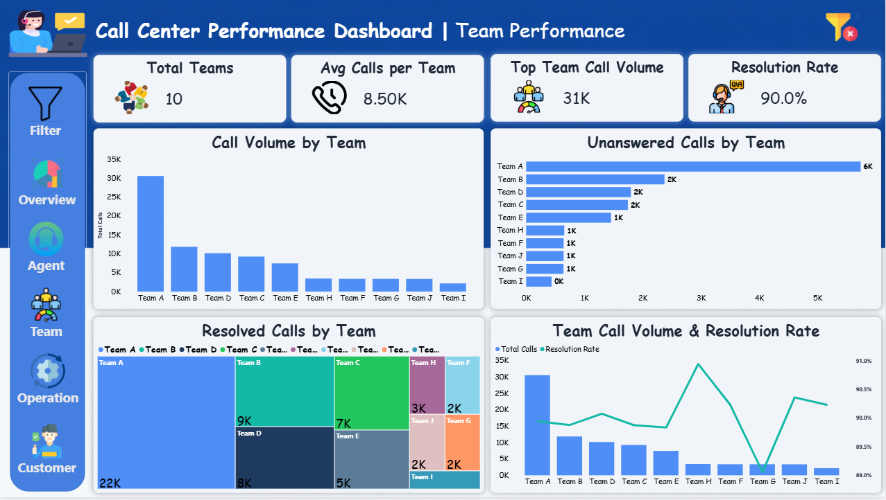
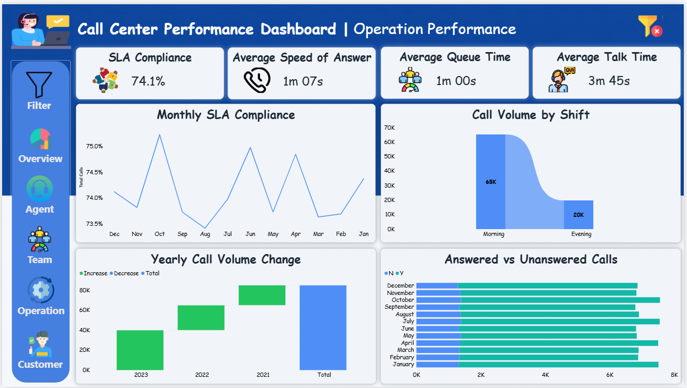
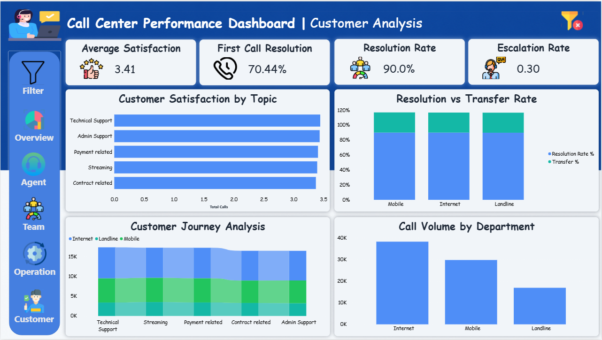

# 📊 Telecom Call Center Analytics Dashboard
 

An interactive **Power BI** dashboard designed to analyze and monitor the performance of a Telecom Call Center using real-world business KPIs.

This project demonstrates the complete Business Intelligence workflow, including data preparation, data modeling, DAX calculations, and interactive dashboard development.

---

# 📌 Project Overview

This dashboard provides decision-makers with a comprehensive view of call center performance by analyzing:

- Executive KPIs
- Agent Performance
- Team Performance
- Operations Performance
- Customer Experience

The project was built using a **Star Schema** data model and advanced **DAX Measures** to deliver meaningful business insights.

---

# 🎯 Project Objectives

- Monitor overall call center performance.
- Evaluate agent productivity.
- Compare team performance.
- Track operational efficiency.
- Measure customer service quality.
- Identify improvement opportunities using KPIs.

---

# 🛠 Tools & Technologies

| Tool | Purpose |
|-------|----------|
| Power BI | Dashboard Development |
| Power Query | Data Cleaning & Transformation |
| DAX | KPI Calculations |
| Excel | Data Preparation |
| Python | Data Generation & Preprocessing |
| Star Schema | Data Modeling |

---

# 🏗 Data Model

The project follows a **Star Schema** architecture.

### Fact Tables

- Fact_Calls
- Fact_Agent_Daily

### Dimension Tables

- Dim_Agents
- Dim_Date

---

# 📈 Key Performance Indicators (KPIs)

## Executive Overview

- Total Calls
- Answer Rate
- Resolution Rate
- SLA Compliance
- Active Agents

---

## Agent Performance

- Average Handle Time (AHT)
- Calls per Agent
- Occupancy Rate
- Utilization Rate
- Top Performing Agents

---

## Team Performance

- Total Teams
- Average Calls per Team
- Highest Team Call Volume
- Resolution Rate
- Team Call Distribution

---

## Operation Performance

- SLA Compliance
- Average Speed of Answer
- Average Queue Time
- Average Talk Time
- Answered vs Unanswered Calls

---

## Customer Analysis

- Customer Satisfaction
- First Call Resolution (FCR)
- Transfer Rate
- Escalation Rate
- Department Performance

---

# 📄 Dashboard Pages

## 1️⃣ Executive Overview

Provides an executive summary of the entire call center with the most important KPIs and monthly performance trends.


---

## 2️⃣ Agent Performance

Analyze individual agent productivity using:

- Average Handle Time
- Occupancy
- Utilization
- Calls per Agent
- Top Performing Agents



---

## 3️⃣ Team Performance

Compare team productivity and workload through:

- Team Call Volume
- Resolution Rate
- Unanswered Calls
- Team KPI Comparison



---

## 4️⃣ Operation Performance

Monitor operational efficiency including:

- SLA Compliance
- Queue Time
- Speed of Answer
- Talk Time
- Call Distribution by Shift



---

## 5️⃣ Customer Analysis

Measure customer experience through:

- Customer Satisfaction
- FCR
- Transfer Rate
- Escalation Rate
- Department Comparison



---

# 💼 Business Questions Answered

- How many calls were handled?
- What is the current SLA compliance?
- Which agents perform best?
- Which teams receive the highest workload?
- Which department generates the highest call volume?
- How efficient are the operations?
- How satisfied are customers?
- What is the First Call Resolution rate?
- How often are calls transferred?
- Which KPIs require operational improvement?

---

# 📊 Project Features

- Interactive Navigation Buttons
- Dynamic KPIs
- Custom Tooltips
- Bookmarks
- Drill-through
- Responsive Filters
- Cross Filtering
- Custom Theme
- Professional UI Design

---

# 📂 Repository Structure

```text
Telecom-Call-Center-Analytics
│
├── Dashboard
│   └── Call Center Analytics Dashboard.pbix
│
├── Dataset
│   ├── Fact_Calls.csv
│   ├── Fact_Agent_Daily.csv
│   ├── Dim_Agents.csv
│   └── Telecom Company Call-Center-Dataset.xlsx
│
├── Images
│   ├── Overview.png
│   ├── Agent_Performance.png
│   ├── Team_Performance.png
│   ├── Operation_Performance.png
│   └── Customer_Analysis.png
│
├── Notebook
│   └── data.ipynb
│
├── Icons
│
└── README.md
```

---

# 🚀 How to Open

1. Download the repository.
2. Open the **.pbix** file using **Power BI Desktop**.
3. Refresh the data if needed.
4. Explore the dashboard using the navigation menu.

---

# 📌 Skills Demonstrated

- Data Cleaning
- Data Modeling
- Star Schema Design
- DAX
- Power Query
- Dashboard Design
- Data Visualization
- Business Intelligence
- KPI Development
- Business Analytics

---

# 👨‍💻 Author

**Ahmed Esam**

- GitHub: https://github.com/Ahmed-Esam20

---

## ⭐ If you found this project useful, don't forget to give it a Star!